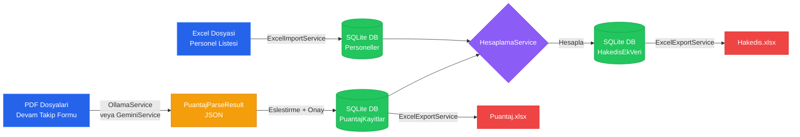
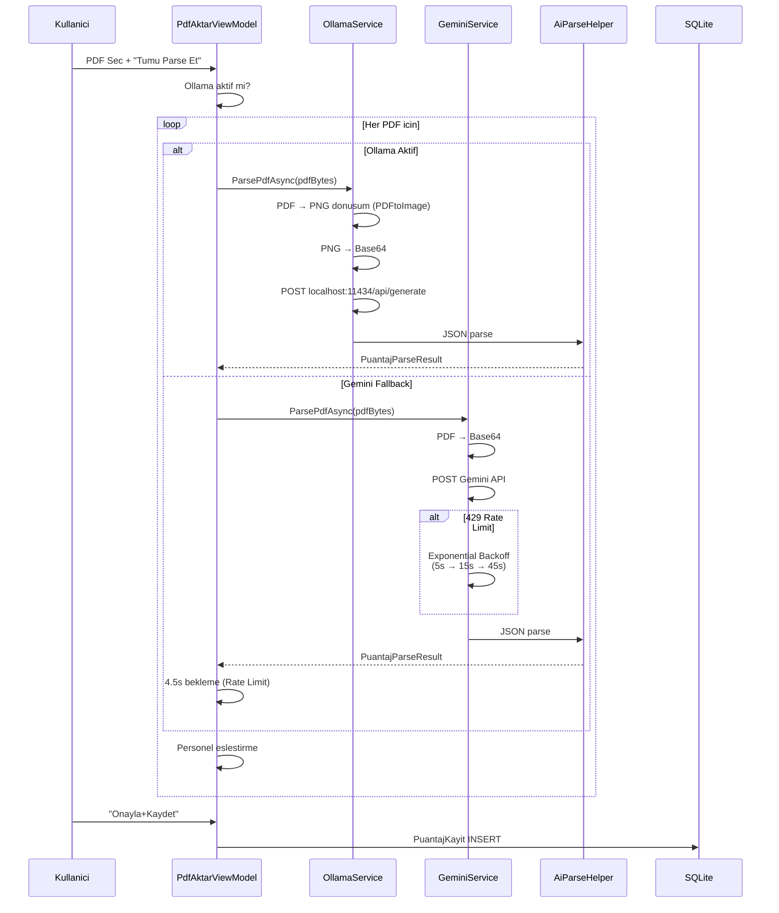
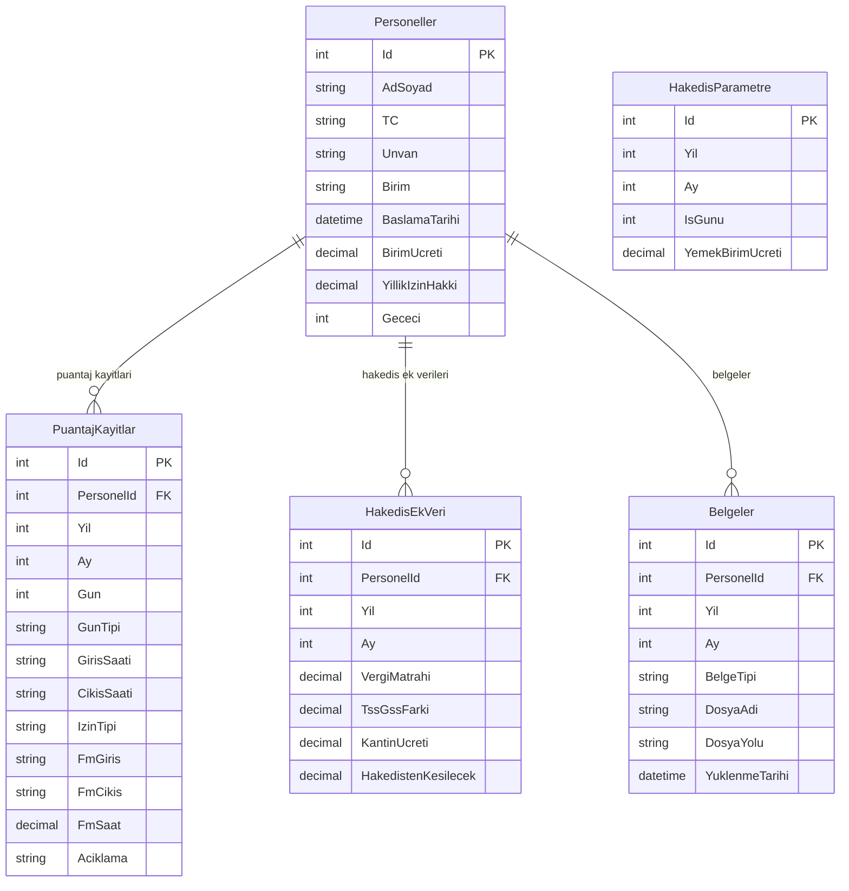
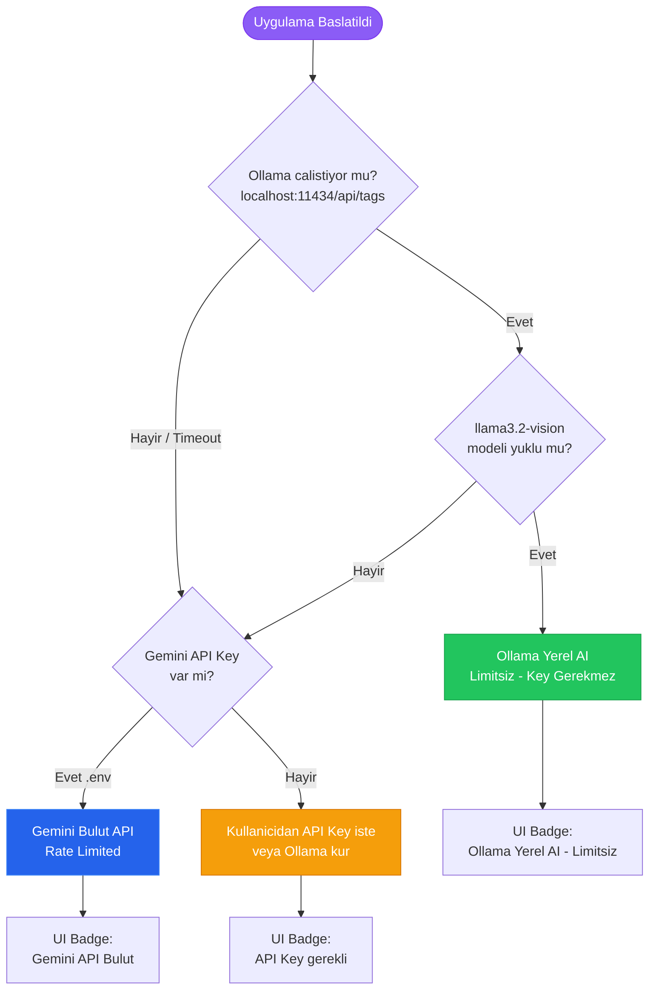
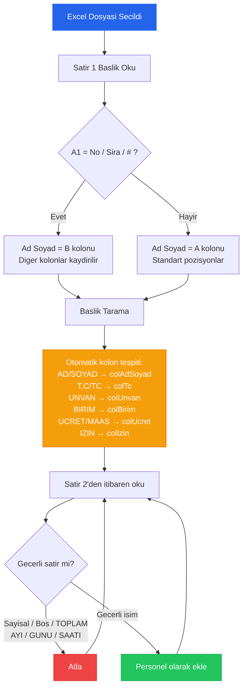
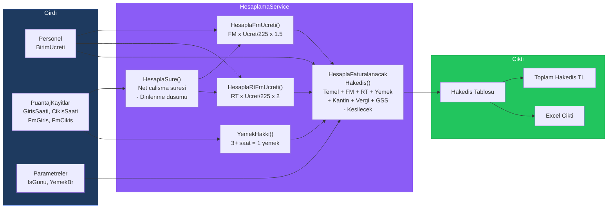
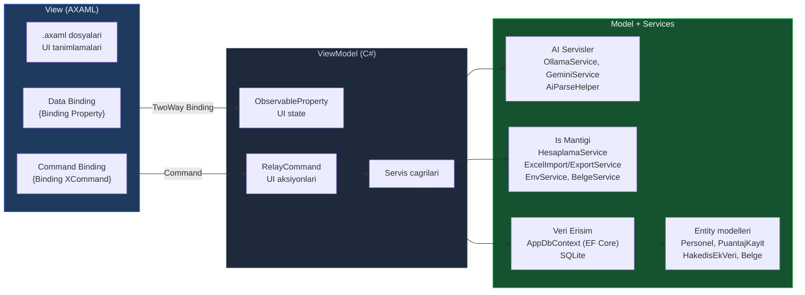
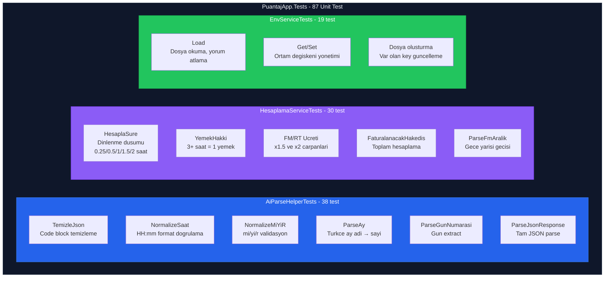

# Puantaj & Hakedis Uygulamasi

NVI TD projesi icin altyuklenici personel puantaj takip ve hakedis hesaplama uygulamasi.

PDF devam takip formlarindaki el yazisi giris/cikis saatlerini **AI** ile otomatik okur, puantaj ve hakedis hesaplamalarini yapar, Excel ciktisi uretir.

**Iki AI backend destegi:**
- **Ollama (Yerel)** — Limitsiz, ucretsiz, internet gerekmez, API key gerekmez
- **Google Gemini (Bulut)** — Hizli, free tier mevcut, API key gerekir

---

## Ozellikler

- **Personel yonetimi** — Excel'den toplu import veya manuel ekleme
- **PDF otomatik okuma** — Ollama (yerel) veya Gemini (bulut) Vision AI ile devam takip formlarini parse etme
- **Puantaj girisi** — PDF'den gelen verileri gorup manuel duzenleme
- **Hakedis hesaplama** — FM/RT ucreti, yemek hakki otomatik; vergi, GSS, kantin manuel
- **Excel cikti** — Puantaj ve Hakedis kapak Excel dosyalari
- **Belge yonetimi** — PDF/resim yukleme ve arsivleme

---

## Gereksinimler

### 1. .NET 9 SDK

Bilgisayarinizda .NET 9 SDK kurulu olmalidir.

**macOS (Homebrew ile):**
```bash
brew install dotnet@9
```

**Windows:**
https://dotnet.microsoft.com/download/dotnet/9.0 adresinden SDK'yi indirip kurun.

**Kontrol:**
```bash
dotnet --version
# 9.0.xxx gibi bir cikti gormelisiniz
```

### 2. AI Backend (Birini Secin)

#### Secenek A: Ollama — Yerel AI (Onerilen)

Tamamen ucretsiz, limitsiz, API key gerekmez. Bir kere kurulur, sonsuza kadar calisir.

**Windows:**
```bash
winget install Ollama.Ollama
ollama pull llama3.2-vision:11b
```

**macOS:**
```bash
brew install ollama
ollama pull llama3.2-vision:11b
```

> **Not:** Model indirme ~7GB. Bir kere indirilir. Ollama arka planda calisirken uygulama otomatik olarak yerel AI kullanir.

#### Secenek B: Gemini API — Bulut AI

Daha hizli ama API key ve internet gerektirir.

1. https://aistudio.google.com/apikey adresine gidin
2. Google hesabinizla giris yapin
3. **"Create API Key"** butonuna tiklayin
4. Olusturulan anahtari kopyalayin

> **Not:** Free tier dakikada 15 istek (RPM) ve gunluk 1500 istek sinirina sahiptir. 159 personel icin yeterlidir.

#### Karsilastirma

| | Ollama (Yerel) | Gemini (Bulut) |
|---|---|---|
| API Key | Gerekmez | Gerekli |
| Internet | Gerekmez | Gerekli |
| Kota/Limit | Limitsiz | 1500/gun |
| Hiz | ~5-10s/PDF | ~2-3s/PDF |
| Model degisikligi | Siz kontrol edersiniz | Google degistirebilir |
| Kurulum | ~7GB model indirme | Sadece API key |

---

## Kurulum

### 1. Projeyi indirin

```bash
git clone https://github.com/murataslan1/puantaj-app.git
cd puantaj-app/PuantajApp
```

Veya ZIP olarak indirip acin.

### 2. Uygulamayi calistirin

```bash
cd PuantajApp
dotnet run
```

Ilk calistirmada NuGet paketleri otomatik indirilir (internet gerekir, 1-2 dakika surebilir).
Uygulama penceresi acilacaktir.

> **Not:** Ollama kuruluysa API key girmenize gerek yok. Uygulama otomatik olarak yerel AI kullanir.
> Gemini kullanacaksaniz, API key'i uygulama icinden gireceksiniz ve otomatik kaydedilecek.

---

## Kullanim Kilavuzu (Adim Adim)

Uygulama 6 sekmeden olusur. Islemleri asagidaki siraya gore yapin:

```
Personel Import → PDF Parse → Onayla → Puantaj Kontrol → Hakedis Hesapla → Excel Cikti
```

---

### ADIM 1: Personel Ekleme (Personel Sekmesi)

Bu adimda calisanlari sisteme tanimlarsiniz. Iki yontem vardir:

#### Yontem A: Excel'den Toplu Import (Onerilen)

1. **Personel** sekmesine gidin
2. **"Excel'den Import"** butonuna tiklayin
3. Personel listesini iceren `.xlsx` dosyasini secin
4. Personeller tabloya yuklenecektir

**Excel Format Gereksinimleri:**
- Ilk satir baslik satiri olmalidir
- Uygulama sutunlari otomatik tanir (Ad Soyad, TC, Unvan, Birim, vb.)
- Sira numarasi (No) sutunu varsa otomatik atlanir
- Ornek format:

| No | Ad Soyad | TC | Unvan | Birim | Baslama | Birim Ucreti | Yillik Izin | Gececi |
|---|---|---|---|---|---|---|---|---|
| 1 | AYSEL KOKSALDI | 12345678901 | Kisisel.Op. | Pasaport | 01.01.2024 | 15000 | 14 | 0 |

#### Yontem B: Manuel Ekleme

1. **Personel** sekmesindeki formu doldurun (Ad Soyad, TC, Unvan, Birim, Birim Ucreti vb.)
2. **"Kaydet"** butonuna tiklayin

#### Personel Silme

1. Tablodan silmek istediginiz personeli secin (satirina tiklayin)
2. **"Sil"** butonuna tiklayin

---

### ADIM 2: PDF Okuma / Gemini AI Parse (PDF Aktar Sekmesi)

Bu adimda devam takip formu PDF'lerini AI ile okutursunuz.

1. **PDF Aktar** sekmesine gidin
2. **Ay** ve **Yil** degerlerini ayarlayin (hangi ayin puantaji?)
3. **AI Backend** kontrolu:
   - Sag ustte aktif backend gorunur: "Ollama (Yerel AI - Limitsiz)" veya "Gemini API (Bulut)"
   - **Ollama kuruluysa:** API Key alanini bos birakabilirsiniz, otomatik yerel AI kullanilir
   - **Gemini kullaniyorsaniz:** API Key alanina anahtarinizi yapisitirin (otomatik kaydedilir)
4. **"PDF Sec..."** butonuyla devam takip formu PDF'lerini secin
   - Birden fazla PDF secebilirsiniz (Ctrl+Click veya Shift+Click)
5. **"Tumu Parse Et"** butonuna tiklayin
6. Bekleme suresi:
   - **Ollama:** Rate limit yok, art arda isler (~5-10s/PDF, donanima bagli)
   - **Gemini:** Her PDF arasi ~4.5 saniye (API limiti icin), 159 PDF icin ~12 dakika
   - Gemini 429 hatasi alirsa otomatik bekleyip tekrar dener (3 deneme, exponential backoff)

**Parse Sonuclari:**
- **Eslesti** — PDF'deki isim veritabanindaki bir personelle eslestirildi
- **Eslesmedi** — Isim bulunamadi (personel import edilmemis olabilir)
- **Hata** — PDF okunamiyor veya API hatasi

> **Onemli:** Parse isleminden ONCE personellerin import edilmis olmasi gerekir. Aksi takdirde eslestirme yapilamaz.

---

### ADIM 3: Parse Sonuclarini Onaylama (PDF Aktar Sekmesi)

Parse tamamlandiktan sonra her PDF'i tek tek onaylamaniz gerekir.

1. PDF listesinde "Eslesti" yazan satirlari kontrol edin
2. **Eslesen Personel** kolonundaki ismin dogru oldugunu dogrulayin
3. Her satir icin **"Onayla+Kaydet"** butonuna tiklayin
4. Durum "Onaylandi" olarak degisecektir

> **Onemli:** "Onayla+Kaydet" tiklamadan puantaj kaydi olusturulmaz. Bu adimi ATLAMAYIN.

**Onaylama ne yapar?**
- PDF'den okunan giris/cikis saatlerini veritabanina yazar
- Ilgili personelin o ay icin puantaj kayitlarini olusturur
- Puantaj ve Hakedis sekmelerinde gorunur hale getirir

---

### ADIM 4: Puantaj Kontrolu (Puantaj Sekmesi)

Bu adimda PDF'den okunan verileri kontrol edip gerekirse duzeltirsiniz.

1. **Puantaj** sekmesine gidin
2. **Ay** ve **Yil** secin
3. **Personel** dropdown'undan bir personel secin
4. Tabloda o personelin gunluk giris/cikis saatleri gorunur

**Tablo Kolonlari:**
| Kolon | Aciklama |
|---|---|
| Gun | Gun numarasi (1-31) |
| Tip | Hi = Hafta ici, HS = Hafta sonu, RT = Resmi tatil |
| Giris | Ise giris saati (ornek: 09:00) |
| Cikis | Isten cikis saati (ornek: 18:00) |
| Mi/Yi/R | mi = Mazeret izni, yi = Yillik izin, r = Rapor |
| FM Grs | Fazla mesai giris saati |
| FM Cks | Fazla mesai cikis saati |
| FM St | Fazla mesai suresi (saat, otomatik hesaplanir) |
| Sure | Net calisma suresi (dinlenme dusulmus, otomatik) |
| Yemek | Yemek hakki (3+ saat calisma = 1 yemek) |
| Aciklama | Ek not |

5. Gerekirse satirlari duzeltebilirsiniz (giris/cikis saatleri, izin tipi, FM vb.)
6. **"Kaydet"** butonuna tiklayin

**Alt paneldeki ozet kartlari:**
- Toplam Sure (saat) — o aydaki toplam calisma suresi
- Yemek (gun) — yemek hakki gun sayisi
- FM (saat) — toplam fazla mesai
- RT FM (saat) — resmi tatil fazla mesai

---

### ADIM 5: Hakedis Hesaplama (Hakedis Sekmesi)

Bu adimda tum personellerin hakedisini hesaplarsiniz.

1. **Hakedis** sekmesine gidin
2. Parametreleri girin:
   - **Ay** / **Yil** — hesaplanacak donem
   - **Is Gunu** — o aydaki is gunu sayisi (ornek: 21)
   - **Yemek Br** — gunluk yemek birim ucreti (ornek: 150.00)
3. **"Hesapla"** butonuna tiklayin
4. Tum personellerin hakedisi tabloda gorunur

**Tablo Kolonlari:**
| Kolon | Aciklama |
|---|---|
| Ad Soyad | Personel adi |
| Hak.Gun | Hakedis gun sayisi |
| FM Saat / FM Ucr | Fazla mesai suresi ve ucreti |
| RT Saat / RT Ucr | Resmi tatil FM suresi ve ucreti |
| Yemek | Yemek hakki tutari |
| FM Ym | Fazla mesai yemek tutari |
| Hakedis | Faturalanacak toplam hakedis |

5. Bir personeli secin, alt panelde **manuel degerler** girin:
   - **Vergi Matrahi** — vergi matrahi tutari
   - **TSS-GSS** — TSS-GSS farki
   - **Kantin** — kantin ucreti
   - **Kesilecek** — hakedisten kesilecek tutar
6. **"Kaydet"** butonuna tiklayin

**Sag altta TOPLAM HAKEDIS tutari (TL) gorunur.**

---

### ADIM 6: Excel Cikti Olusturma (Excel Cikti Sekmesi)

Bu adimda puantaj ve hakedis verilerini Excel dosyasina aktarirsiniz.

1. **Excel Cikti** sekmesine gidin
2. Parametreleri girin: Ay, Yil, Is Gunu, Yemek Br
3. **Kayit Yeri** alaninda dosyanin kaydedilecegi klasoru secin ("Sec..." butonu ile)
4. Iki tur cikti olusturabilirsiniz:
   - **"Puantaj Excel Olustur"** → `Puantaj_OCAK_2026_Mesai.xlsx`
   - **"Hakedis Kapak Excel Olustur"** → `NVI_TD_OCAK_2026_HAKEDIS.xlsx`
5. Dosyalar sectiginiz klasore kaydedilir

---

### ADIM 7: Belge Yonetimi (Belgeler Sekmesi) — Opsiyonel

Personellere ait PDF/resim belgelerini arsivleyebilirsiniz.

1. **Belgeler** sekmesine gidin
2. **Personel**, **Ay**, **Yil** ve **Belge Tipi** secin:
   - `devam_takip` — devam takip formu
   - `izin_formu` — izin formu
   - `rapor` — saglik raporu
3. **"PDF/Resim Yukle"** ile belgeyi ekleyin
4. Yuklenen belgeler listede gorunur
5. **"Ac"** ile goruntuleyin, **"Sil"** ile kaldirin

---

## Hakedis Formulleri

| Hesaplama | Formul |
|---|---|
| Net Calisma Suresi | Giris-Cikis farki - dinlenme suresi |
| Yemek Hakki | 3 saat ve uzeri calisma = 1 yemek |
| FM Ucreti | FM Saat x Birim Ucreti / 225 x 1.5 |
| RT FM Ucreti | RT Saat x Birim Ucreti / 225 x 2 |
| Faturalanacak Hakedis | Temel + FM + RT + Yemek + Kantin + Vergi + GSS - Kesilecek |

**Dinlenme suresi dusumu:**
| Calisma Suresi | Dinlenme |
|---|---|
| 0 - 4 saat | 0.25 saat |
| 4 - 7.5 saat | 0.5 saat |
| 7.5 - 11 saat | 1 saat |
| 11 - 15 saat | 1.5 saat |
| 15+ saat | 2 saat |

---

## Dosya Yapisi

```
puantaj-app/
  README.md                  <- Bu dosya
  PuantajApp/                <- Ana uygulama
    PuantajApp.csproj        <- Proje dosyasi
    Program.cs               <- Giris noktasi
    App.axaml                <- Tema ve global stiller (koyu tema)
    .env                     <- Gemini API Key (otomatik kaydedilir, repo'ya girmez)
    .gitignore
    Data/
      AppDbContext.cs         <- Veritabani (SQLite + EF Core)
    Models/                  <- Veri modelleri
      Personel.cs            <- Personel entity
      PuantajKayit.cs        <- Puantaj kayit entity
      HakedisEkVeri.cs       <- Hakedis ek veri entity
      PuantajParseResult.cs  <- AI parse sonuc modeli
      Belge.cs               <- Belge entity
      HakedisParametre.cs    <- Hakedis parametre entity
    Services/                <- Is mantigi servisleri
      GeminiService.cs       <- Google Gemini API entegrasyonu
      OllamaService.cs       <- Ollama yerel AI entegrasyonu
      AiParseHelper.cs       <- Ortak AI JSON parse yardimcilari
      ExcelImportService.cs  <- Excel'den personel import (otomatik sutun tespiti)
      ExcelExportService.cs  <- Puantaj/Hakedis Excel cikti
      HesaplamaService.cs    <- Hakedis hesaplama formulleri
      EnvService.cs          <- .env dosya okuma/yazma
      BelgeService.cs        <- Belge arsivleme
    Views/                   <- Ekran tasarimlari (AXAML)
    ViewModels/              <- Ekran mantiklari (MVVM)
    puantaj.db               <- Veritabani dosyasi (otomatik olusur)
  PuantajApp.Tests/          <- Unit testler (xUnit)
    AiParseHelperTests.cs    <- AI parse testleri (38 test)
    HesaplamaServiceTests.cs <- Hesaplama testleri (30 test)
    EnvServiceTests.cs       <- Env servis testleri (19 test)
```

---

## Sorun Giderme

**S: Uygulama acilmiyor.**
C: `dotnet --version` komutuyla .NET 9 kurulu oldugundan emin olun. 9.0.x olmalidir.

**S: PDF parse "API Hatasi 404" diyor.**
C: Gemini modeli degismis olabilir. `GeminiService.cs` dosyasindaki `MODEL` degerini kontrol edin. Mevcut: `gemini-2.5-flash-lite`.

**S: PDF parse "API Hatasi 429" diyor.**
C: API kota limiti doldu. Uygulama otomatik olarak bekleyip tekrar dener (3 deneme). Cok fazla 429 aliyorsaniz birkac dakika bekleyin veya https://aistudio.google.com/apikey adresinden yeni bir API key olusturun.

**S: PDF parse ediliyor ama personelle eslesmedi.**
C: Once Personel sekmesinden personelleri import edin. PDF'deki isimler veritabanindaki isimlerle eslestirilir.

**S: Puantaj sekmesinde veri gorunmuyor.**
C: PDF Aktar sekmesinde parse sonuclarini "Onayla+Kaydet" ile onayladiniz mi? Onaylanmadan puantaj kaydi olusturulmaz.

**S: Hakedis sekmesinde liste bos.**
C: Once puantaj kayitlarinin oldugundan emin olun (Adim 4). Sonra "Hesapla" butonuna tiklayin.

**S: Excel'den import yanlis isimler getiriyor.**
C: Excel dosyanizin ilk satirinin baslik satiri oldugundan emin olun. Uygulama "Ad Soyad", "TC", "Unvan" gibi basliklari otomatik tanir.

**S: Veritabanini sifirlamak istiyorum.**
C: `PuantajApp/puantaj.db` dosyasini silip uygulamayi yeniden baslatin. Bos veritabani otomatik olusur.

**S: API key'imi nereye giriyorum?**
C: PDF Aktar sekmesindeki "API Key" alanina yapisitirin. Otomatik olarak `.env` dosyasina kaydedilir. Bir dahaki acilista tekrar girmenize gerek kalmaz.

**S: Ollama kurdum ama uygulama "Gemini API (Bulut)" diyor.**
C: Ollama'nin arka planda calistigindan emin olun (`ollama serve`). Ayrica `llama3.2-vision:11b` modelinin yuklu oldugunu kontrol edin (`ollama list`).

**S: Ollama ile Gemini arasinda nasil gecis yaparim?**
C: Uygulama otomatik secer. Ollama calisiyorsa onu kullanir, degilse Gemini'ye duser. Ollama'yi durdurmak (`ollama stop`) Gemini'ye gecis yapar.

**S: macOS'ta dosya izin hatasi aliyorum.**
C: Terminal'de `chmod +x` gerekebilir veya System Preferences > Privacy'den izin verin.

---

## Teknolojiler

- **C# / .NET 9** — Uygulama platformu
- **Avalonia UI** — Cross-platform masaustu UI framework (koyu tema)
- **SQLite** — Yerel veritabani (Entity Framework Core)
- **Ollama + Llama 3.2 Vision** — Yerel AI PDF parse (limitsiz, ucretsiz)
- **Google Gemini 2.5 Flash Lite** — Bulut AI PDF parse (fallback)
- **PDFtoImage** — PDF'den goruntu donusumu (Ollama icin)
- **ClosedXML** — Excel okuma/yazma
- **CommunityToolkit.Mvvm** — MVVM pattern
- **xUnit** — Unit test framework

---

## Testler

Proje 87 unit test icerir. Testleri calistirmak icin:

```bash
cd PuantajApp.Tests
dotnet test
```

| Test Sinifi | Test Sayisi | Kapsam |
|---|---|---|
| `AiParseHelperTests` | 38 | JSON parse, saat normalize, Turkce ay parse, MiYiR, code block temizleme |
| `HesaplamaServiceTests` | 30 | Net calisma suresi, dinlenme dusumu, yemek hakki, FM/RT ucreti, hakedis, gece yarisi gecisi |
| `EnvServiceTests` | 19 | .env okuma/yazma, yorum satiri, bos satir, mevcut key guncelleme, dosya olusturma |

---

## Teknik Mimari

### Uygulama Katmanlari

```mermaid
graph TB
    subgraph UI["UI Katmani (Views - AXAML)"]
        MW[MainWindow]
        PV[PersonelView]
        PAV[PdfAktarView]
        PTV[PuantajView]
        HV[HakedisView]
        ECV[ExcelCiktiView]
        BV[BelgeView]
    end

    subgraph VM["ViewModel Katmani (MVVM)"]
        MVM[MainWindowViewModel]
        PVM[PersonelViewModel]
        PAVM[PdfAktarViewModel]
        PTVM[PuantajViewModel]
        HVM[HakedisViewModel]
        ECVM[ExcelCiktiViewModel]
        BVM[BelgeViewModel]
    end

    subgraph SVC["Servis Katmani"]
        GS[GeminiService]
        OS[OllamaService]
        APH[AiParseHelper]
        EIS[ExcelImportService]
        EES[ExcelExportService]
        HS[HesaplamaService]
        BS[BelgeService]
        ES[EnvService]
    end

    subgraph DATA["Veri Katmani"]
        DB[(SQLite - puantaj.db)]
        CTX[AppDbContext<br/>Entity Framework Core]
    end

    subgraph EXT["Dis Servisler"]
        OLLAMA[Ollama Yerel AI<br/>llama3.2-vision:11b]
        GEMINI[Google Gemini API<br/>gemini-2.5-flash-lite]
        EXCEL[Excel Dosyalari<br/>.xlsx]
        PDF[PDF Dosyalari<br/>Devam Takip Formu]
        ENV[.env Dosyasi<br/>API Key]
    end

    MW --> MVM
    PV --> PVM
    PAV --> PAVM
    PTV --> PTVM
    HV --> HVM
    ECV --> ECVM
    BV --> BVM

    PAVM --> GS
    PAVM --> OS
    GS --> APH
    OS --> APH
    PVM --> EIS
    ECVM --> EES
    HVM --> HS
    BVM --> BS
    PAVM --> ES

    OS --> OLLAMA
    GS --> GEMINI
    OS --> PDF
    GS --> PDF
    EIS --> EXCEL
    EES --> EXCEL
    ES --> ENV

    PVM --> CTX
    PAVM --> CTX
    PTVM --> CTX
    HVM --> CTX
    BVM --> CTX
    CTX --> DB

    style UI fill:#1E3A5F,stroke:#2563EB,color:#F1F5F9
    style VM fill:#1E293B,stroke:#334155,color:#CBD5E1
    style SVC fill:#1E293B,stroke:#334155,color:#CBD5E1
    style DATA fill:#14532D,stroke:#22C55E,color:#F1F5F9
    style EXT fill:#7F1D1D,stroke:#EF4444,color:#FCA5A5
```



### Veri Akisi (Is Sureci)



### AI PDF Parse Akisi



### Veritabani Semasi



### AI Backend Otomatik Secim



### Excel Import Akisi (Otomatik Sutun Tespiti)



### Hakedis Hesaplama Akisi



### UI Tema Yapisi

```mermaid
graph TD
    subgraph THEME["App.axaml - Global Tema"]
        DM["RequestedThemeVariant = Dark"]
        subgraph COLORS["Renk Paleti"]
            AC["AccentBrush #2563EB"]
            SC["SuccessBrush #22C55E"]
            EC["ErrorBrush #EF4444"]
            WC["WarningBrush #F59E0B"]
            CB["CardBgBrush #1E293B"]
            PB["PageBgBrush #0F172A"]
        end
        subgraph STYLES["Stil Siniflari"]
            S1["Button.primary<br/>Mavi arka plan, beyaz yazi"]
            S2["Button.secondary<br/>Seffaf, gri border"]
            S3["Button.danger<br/>Kirmizi, tehlike aksiyonu"]
            S4["Border.card<br/>Koyu kart, yuvarlatilmis kose"]
            S5["TextBlock.sectionHeader<br/>18px, SemiBold"]
            S6["TextBlock.statValue<br/>20px, Bold, buyuk rakam"]
            S7["TextBlock.label<br/>12px, gri, form etiketi"]
        end
    end

    DM --> COLORS
    COLORS --> STYLES

    style THEME fill:#0F172A,stroke:#334155,color:#F1F5F9
    style COLORS fill:#1E293B,stroke:#334155,color:#CBD5E1
    style STYLES fill:#1E293B,stroke:#334155,color:#CBD5E1
```



### MVVM Mimari Deseni



### Test Kapsami


